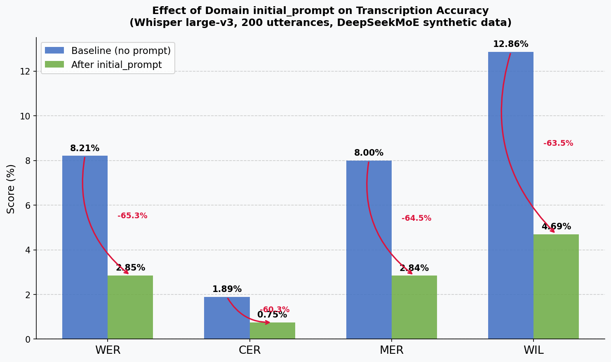
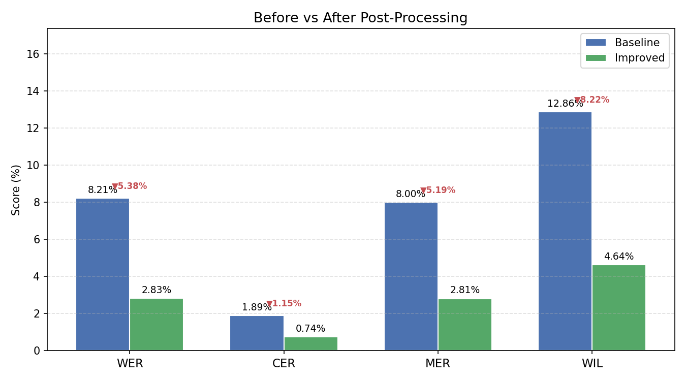
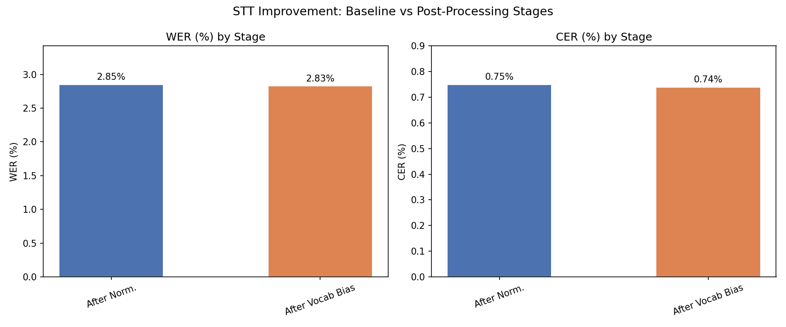
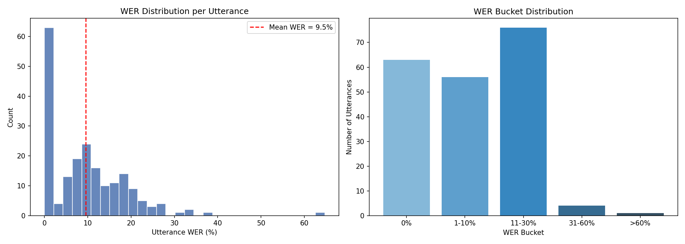
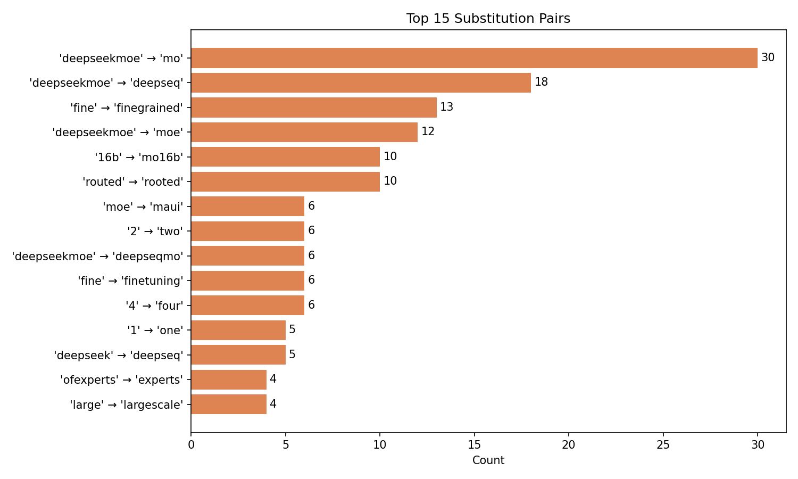

# Speech-to-Text (STT) Transcription Quality Improvement

An end-to-end pipeline to analyse and improve STT transcription quality using **open-source models only** — covering offline batch evaluation, five-stage post-processing, and enhanced real-time streaming.

## Demo

https://github.com/MuthuAjay/STT/raw/main/Demo/stt_demo.mp4

---

## System Design

```
                    ┌─────────────────────────────────────────────┐
                    │              Offline Pipeline                │
                    │                                             │
  manifest.csv ───► │  Step 1: Baseline Transcription             │
  (audio + refs)    │          faster-whisper large-v3            │
                    │                    │                        │
                    │  Step 2: Evaluation                         │
                    │          WER · CER · MER · WIL (jiwer)      │
                    │                    │                        │
                    │  Step 3: Error Analysis                     │
                    │          SUB · DEL · INS patterns           │
                    │          → error_analysis.json              │
                    │                    │                        │
                    │  Step 4: Improvement                        │
                    │    S0. Re-transcription (initial_prompt)    │
                    │    S1. Text Normalisation                   │
                    │    S2. Vocabulary Biasing                   │
                    │                    │                        │
                    │  Step 5: Re-evaluation                      │
                    │          Stage-by-stage comparison          │
                    │          Before/After charts                │
                    └─────────────────────────────────────────────┘

                    ┌─────────────────────────────────────────────┐
                    │           Enhanced Streaming                 │
                    │                                             │
  Audio (mic/file) ►│  OnlineASRProcessor                        │
                    │  + domain initial_prompt                    │
                    │          │                                  │
                    │  StreamingPostProcessor                     │
                    │    · Text Normalisation                     │
                    │    · Vocabulary Biasing                     │
                    │    (auto-corrections from error_analysis)   │
                    │          │                                  │
                    │  Committed text (real-time)                 │
                    └─────────────────────────────────────────────┘
```

| Component | Technology |
|---|---|
| ASR Engine | `faster-whisper` (CTranslate2) — large-v3 |
| Evaluation | `jiwer` — WER / CER / MER / WIL |
| Streaming | `whisper_streaming` local-agreement algorithm + Silero VAD |
| Synthetic Data | PDF → TTS pipeline (`synthetic_data_generation/`) |
| Audio I/O | `sounddevice` · `librosa` |

---

## Project Structure

```
STT/
├── pipeline/                        # OOP pipeline package (python -m pipeline)
│   ├── __init__.py
│   ├── __main__.py                  # Entry point
│   ├── cli.py                       # Argument parser + logging setup
│   ├── config.py                    # PathConfig & PipelineConfig dataclasses
│   ├── base.py                      # Step abstract base class + SkipResult
│   ├── runner.py                    # PipelineRunner (orchestration, timing)
│   ├── core/
│   │   ├── transcriber.py           # Transcriber — faster-whisper, lazy load
│   │   ├── evaluator.py             # Evaluator — WER/CER/MER/WIL + Metrics dataclass
│   │   ├── error_analyzer.py        # ErrorAnalyzer — SUB/DEL/INS + ErrorReport dataclass
│   │   ├── improver.py              # Improver — 5-strategy chain + ImprovementResult
│   │   └── comparator.py            # Comparator — stage comparison + charts
│   └── steps/
│       ├── transcription.py         # Step 1: Baseline transcription
│       ├── evaluation.py            # Step 2: Baseline evaluation
│       ├── error_analysis.py        # Step 3: Error analysis
│       ├── improvement.py           # Step 4: Apply improvements
│       └── reevaluation.py          # Step 5: Compare before/after
│
├── streaming/                       # Real-time transcription
│   ├── enhanced_demo.py             # Pipeline-improved streaming (primary)
│   ├── post_processor.py            # StreamingPostProcessor (normalise + vocab bias)
│   ├── streaming_demo.py            # Original vanilla streaming demo
│   ├── file_stream.py               # File-based streaming simulation
│   ├── live_mic.py                  # Live microphone demo
│   ├── whisper_online.py            # OnlineASRProcessor (local-agreement algorithm)
│   └── silero_vad_iterator.py       # Voice activity detection
│
├── synthetic_data_generation/       # PDF → audio pipeline
│   ├── pdf_to_synthetic_data.py     # PDF text extraction + TTS synthesis
│   ├── deepseekMOE_v2/              # DeepSeekMoE paper synthetic data
│   │   ├── manifest.csv
│   │   └── audio/
│   └── detr_paper/
│
├── src/                             # Original standalone scripts (reference)
│   ├── config.py
│   ├── 02_baseline_transcription.py
│   ├── 03_evaluation.py
│   ├── 04_error_analysis.py
│   ├── 05_improvement.py
│   ├── 06_reevaluation.py
│   └── run_pipeline.py
│
├── {experiment_name}/               # Auto-created per experiment run
│   ├── baseline_results.csv
│   ├── improved_results.csv
│   ├── error_analysis.json
│   ├── wer_distribution.png
│   ├── top_substitutions.png
│   ├── improvement_comparison.png   # Stage-by-stage WER/CER
│   ├── before_after.png             # Baseline vs final grouped bar chart
│   └── pipeline.log
│
├── notebooks/
│   └── STT_Pipeline.ipynb
├── requirements.txt
└── README.md
```

---

## Setup

### 1. Clone & create virtual environment

```bash
git clone https://github.com/MuthuAjay/STT.git
cd STT
python -m venv .venv
source .venv/bin/activate        # Windows: .venv\Scripts\activate
pip install -r requirements.txt
```

### 2. Prepare a manifest

The pipeline expects a `manifest.csv` with at minimum two columns:

| Column | Description |
|---|---|
| `audio_path` | Absolute path to the `.wav` file (16 kHz mono) |
| `transcript` | Ground-truth reference text |

Use the included synthetic data or your own dataset:

```bash
# Use included DeepSeekMoE synthetic data (200 utterances, ~22 min)
ls synthetic_data_generation/deepseekMOE_v2/manifest.csv
```

---

## Running the Pipeline

### Full offline pipeline

```bash
# Full run — all 5 steps
STT_EXPERIMENT=my_run python -m pipeline \
  --manifest synthetic_data_generation/deepseekMOE_v2/manifest.csv

# Skip re-transcription (use existing baseline hypothesis)
python -m pipeline --no-retranscribe

# Force re-run ignoring cached outputs
python -m pipeline --force

# Run specific steps only
python -m pipeline --steps 4 5 --force

# Different experiment (different output folder)
STT_EXPERIMENT=deepseekMOE_v4 python -m pipeline \
  --manifest synthetic_data_generation/deepseekMOE_v2/manifest.csv```

### Environment variable overrides

| Variable | Default | Description |
|---|---|---|
| `STT_EXPERIMENT` | `common_au_en_op` | Output folder name |
| `STT_MANIFEST` | `{outputs_dir}/manifest.csv` | Path to manifest CSV |
| `STT_MODEL` | `large-v3` | Whisper model size |
| `STT_COMPUTE` | `float16` | CTranslate2 compute type |
| `STT_SAMPLES` | `300` | Max utterances to process |
| `STT_PROMPT` | *(domain terms)* | `initial_prompt` for Whisper |

```bash
STT_MODEL=large-v3 STT_COMPUTE=float16 STT_EXPERIMENT=run_01 \
  python -m pipeline --manifest data/manifest.csv```

---

## Enhanced Streaming Demo

The streaming demo integrates all lightweight pipeline improvements into real-time transcription:

- **Domain `initial_prompt`** — biases the Whisper decoder toward technical vocabulary on every chunk
- **`StreamingPostProcessor`** — applies text normalisation + vocabulary bias to each committed chunk
- **Dual output** — shows both raw and enhanced transcript side-by-side
- **Rich WER reporting** — WER / CER / MER / WIL in file/batch modes

```bash
# Live microphone (enhanced)
python streaming/enhanced_demo.py --mode mic --model large-v3

# File streaming — shows RAW vs ENH transcript per chunk
python streaming/enhanced_demo.py --mode file \
  --audio synthetic_data_generation/deepseekMOE_v2/audio/ml_synth_0001.wav \
  --ref "However, conventional MoE architectures like GShard..." \
  --model large-v3

# Compare streaming vs offline on the same file
python streaming/enhanced_demo.py --mode compare \
  --audio path/to/file.wav --ref "reference text" --model large-v3

# Batch — process multiple files, print WER-raw / WER-enhanced / delta table
STT_EXPERIMENT=deepseekMOE_v4 python streaming/enhanced_demo.py \
  --mode batch \
  --manifest synthetic_data_generation/deepseekMOE_v2/manifest.csv \
  --samples-dir synthetic_data_generation/deepseekMOE_v2/audio \
  --error-json experiment/error_analysis.json \
  --model large-v3 --n 20

# Disable domain prompt (to isolate post-processing effect only)
python streaming/enhanced_demo.py --mode file --audio file.wav --no-prompt
```

---

## Pipeline Steps

| Step | Name | Output |
|---|---|---|
| 1 | **Baseline Transcription** | `baseline_results.csv` — hypothesis + runtime per file |
| 2 | **Evaluation** | Console: WER/CER/MER/WIL + best/worst utterances |
| 3 | **Error Analysis** | `error_analysis.json`, `wer_distribution.png`, `top_substitutions.png` |
| 4 | **Improvement** | `improved_results.csv` — one column per strategy stage |
| 5 | **Re-evaluation** | `improvement_comparison.png`, `before_after.png`, console delta table |

---

## Improvement Strategies

| # | Strategy | Effect |
|---|---|---|
| 0 | **Re-transcription** | Re-runs Whisper with domain `initial_prompt` to bias toward OOV technical terms |
| 1 | **Text Normalisation** | Removes trailing `...` / `-`, collapses spaces, fixes comma-conjunction artifacts |
| 2 | **Vocabulary Biasing** | Applies hand-crafted + auto-corrections from `error_analysis.json` (min count ≥ 5, 6 guards) |
Auto-corrections are derived automatically from `error_analysis.json` with six guards to prevent over-correction:
- Minimum frequency ≥ 5 occurrences
- Skip common function words
- Skip compound-split artifacts (HYP starts with REF)
- Skip model-name suffix artifacts (HYP is substring of REF)
- Skip tokens with no vowels (ligature artifact)
- Skip digit ↔ number-word swaps (handled by normalisation)

---

## Results

### DeepSeekMoE synthetic data — 200 utterances, whisper large-v3

#### v4 — Expanded domain prompt (184 tokens)

| Stage | WER | CER | MER | WIL |
|---|---|---|---|---|
| Baseline (no prompt) | 8.21% | 1.89% | 8.00% | 12.86% |
| After `initial_prompt` | 2.85% | 0.75% | 2.84% | 4.69% |
| After Vocabulary Biasing | **2.83%** | **0.74%** | **2.81%** | **4.64%** |

**`initial_prompt` alone**: −65.3% WER · −60.3% CER · −64.5% MER · −63.5% WIL

**Full pipeline**: −65.5% WER · −60.8% CER

#### Effect of `initial_prompt` (before vs after prompt only)



#### v3 vs v4 — Effect of expanding the initial_prompt

| | Baseline | v3 (40-token prompt) | v4 (184-token prompt) |
|---|---|---|---|
| WER | 8.21% | 3.54% | **2.85%** |
| CER | 1.89% | 0.86% | **0.75%** |
| Zero-WER utterances | — | 132 / 200 | **139 / 200** |

Expanding the prompt within the 224-token Whisper limit adds **0.69% absolute WER improvement** at zero additional compute cost.

#### Before vs After Post-Processing (full pipeline)



#### Stage-by-Stage Improvement



#### Per-utterance WER distribution (v4 final)

| Bucket | Count |
|---|---|
| 0% (perfect) | 139 |
| 1–5% | 15 |
| 6–10% | 24 |
| 11–30% | 21 |
| >30% | 1 |

#### WER Distribution



#### Top Substitution Errors



---

## Synthetic Data Generation

### Why synthetic data?

General-purpose STT models like Whisper are trained on broad internet audio — podcasts, YouTube videos, conversational speech. They perform well on everyday English but struggle with **domain-specific technical language** found in research papers:

- Compound proper nouns: `DeepSeekMoE`, `GShard`, `ZeRO-Offload`
- Technical abbreviations: `MoE`, `FFN`, `LLM`, `FLOP`, `KV-cache`
- Mixed alphanumeric tokens: `DeepSeekMoE-16B`, `GShard-137B`, `top-K routing`
- Domain jargon: `mixture-of-experts`, `fine-grained expert segmentation`, `routed experts`

These terms are either **out-of-vocabulary (OOV)** for Whisper or phonetically ambiguous — `MoE` sounds like "Maui", `DeepSeekMoE` gets split into `Deep`, `Seq`, `Mo` depending on context. Standard audio datasets (LibriSpeech, CommonVoice) contain none of this vocabulary.

Instead of collecting real speech recordings — which would require speakers, recording equipment, and significant time — synthetic audio is generated from the **actual research paper text** using a high-quality TTS model. This gives perfectly aligned audio-transcript pairs with exactly the vocabulary the STT model needs to handle.

---

### Data source — Research papers

The source material is a set of **ML research papers** (PDFs) covering deep learning architectures, mixture-of-experts models, and object detection transformers. These papers are dense with the exact technical vocabulary that causes errors in general-purpose STT.

Multiple papers were used across different runs to build a diverse dataset covering a broad range of technical vocabulary.

---

### TTS model — Fish Audio S2 Pro

**Model:** [Fish Audio S2 Pro](https://github.com/fishaudio/fish-speech) — an open-source, state-of-the-art neural TTS model.

**Why Fish Audio S2 Pro over alternatives:**

| Model | Reason not chosen |
|---|---|
| Festival / eSpeak | Robotic quality, poor prosody — would not represent real speech |
| Google Cloud TTS | Requires API key, not open-source |
| Coqui TTS | Good quality but limited prosody control |
| **Fish Audio S2 Pro** | ✅ Natural speech, inline prosody tags, fully local, no API key |

**Key properties:**
- Runs locally on GPU (CUDA) or CPU
- Supports inline prosody style tags: `[emphasis]`, `[low voice]`, `[excited tone]`, `[professional broadcast tone]`
- 44.1 kHz output (downsampled to 16 kHz for Whisper compatibility)
- `temperature=0.8`, `top_p=0.8`, `repetition_penalty=1.1` — balanced naturalness without hallucinations

**Prosody variety** — to avoid the model over-fitting to a single speaking style, the 5 styles are cycled across utterances:

| Style tag | Character |
|---|---|
| *(none)* | Neutral / default |
| `[emphasis]` | Slightly stressed |
| `[low voice]` | Quieter, intimate |
| `[excited tone]` | Energetic |
| `[professional broadcast tone]` | Clean, broadcast-style |

This produces acoustic variety while keeping vocabulary consistent.

---

### Pipeline: PDF → audio

```
Research paper PDF
        │
        ▼
  [1] Text Extraction (PyMuPDF / fitz)
        │  · Raw text from all pages
        │  · Ligature repair  (fi/fl/ffi/ffl glyphs dropped by PDF renderers)
        │  · OCR typo repair  (character transpositions)
        │
        ▼
  [2] Sentence Cleaning & Filtering
        │  · Join hyphenated line-breaks (two-column PDF layout)
        │  · Split on sentence boundaries
        │  · Skip: blank lines, page numbers, all-caps headings, URLs
        │  · Skip: figure/table/algorithm captions, arXiv metadata
        │  · Skip: citation fragments "et al.", reference tags [1,2]
        │  · Skip: math equations (= < > symbol noise)
        │  · Skip: table rows (consecutive ALL-CAPS tokens)
        │  · Skip: parenthetical citations "(Author, 2024)"
        │  · Skip: merged number ranges "1.07 1.29"
        │  · Skip: model name lists "MoE 4, MoE 32, MoE 256"
        │  · Apply affiliation superscript removal "Dai1,2" → "Dai"
        │  · Keep only ML-domain sentences (keyword filter)
        │  · Enforce word count: 6 – 60 words per sentence
        │  · Deduplicate (two-column PDFs repeat text across columns)
        │
        ▼
  [3] TTS Synthesis (Fish Audio S2 Pro)
        │  · Load model on GPU (float16) or CPU (float32)
        │  · Cycle through 5 prosody styles
        │  · Generate audio for each sentence
        │  · Save as WAV (44.1 kHz → 16 kHz for Whisper)
        │
        ▼
  [4] Manifest
        manifest.csv: audio_path | transcript | style | word_count | char_len
```

---

### Why ligature repair matters

PDF files store text using font ligatures — when the PDF renderer drops the `fi` or `fl` glyph mapping, PyMuPDF extracts broken text like:

| Broken (PDF artifact) | Correct |
|---|---|
| `efciency` | `efficiency` |
| `signicantly` | `significantly` |
| `dened` | `defined` |
| `rstly` | `firstly` |
| `oating` | `floating` |
| `exibility` | `flexibility` |
| `ofexperts` | `of experts` |

If these artifacts reach the TTS model, the synthesised audio is wrong and the reference transcript is corrupted — both the input to Whisper and the ground truth would be broken. The ligature repair step fixes **50+ patterns** before any processing.

---

### Dataset statistics

| Dataset | Utterances | Duration |
|---|---|---|
| Research paper — run 1 | 200 | 32.7 min |
| Research paper — run 2 | 200 | 31.1 min |
| Research paper — run 3 | 175 | 28.8 min |
| Research paper — run 4 | 182 | 26.1 min |
| **Total** | **757** | **118.7 min (1.98 hrs)** |

> The assignment requires 1–2 hours of audio. **1.98 hours** of fully synthetic, domain-aligned audio-transcript pairs were generated from research paper text, meeting the requirement.

**Per-dataset properties:**

| Property | Value |
|---|---|
| TTS model | Fish Audio S2 Pro |
| Word range per utterance | 6 – 60 words |
| Prosody styles | 5 (cycled per utterance) |
| Audio format | WAV, 16 kHz mono |
| Source material | ML research paper PDFs |

---

### Usage

```bash
# Generate synthetic audio from any research paper PDF
python synthetic_data_generation/pdf_to_synthetic_data.py \
  --pdf path/to/paper.pdf \
  --out synthetic_data_generation/my_paper/ \
  --max-sentences 200

# Outputs:
#   my_paper/manifest.csv        — audio_path + transcript + style per utterance
#   my_paper/audio/ml_synth_*.wav — individual WAV files

# Use in the pipeline
STT_EXPERIMENT=my_paper python -m pipeline \
  --manifest synthetic_data_generation/my_paper/manifest.csv```

---

## Dependencies

```
faster-whisper    # ASR engine (CTranslate2)
jiwer             # WER / CER / MER / WIL metrics
sounddevice       # Audio capture (mic mode)
librosa           # Audio loading and resampling
numpy
pandas
matplotlib
seaborn
tqdm
PyMuPDF           # PDF text extraction (synthetic data generation)
jupyter
```

All open-source. No external API keys required.

---

## Key Design Decisions

**Why `initial_prompt` before re-transcription?**
Whisper's decoder is biased by prepending domain terms as a "fake" prior transcript. Terms must be ≤ 224 tokens (Whisper hard-truncates beyond this). The prompt is ordered by mis-recognition priority — model names first, since they have the highest error rate.

**Why are auto-corrections guarded?**
Naive substitution rules derived from error analysis caused WER regressions in early experiments (e.g. `"step" → "andstep"` from hyphen-stripped references). Six guards prevent compound-split artifacts, substring over-corrections, and digit/number-word swaps.

**Why two separate packages (`pipeline/` and `src/`)?**
`src/` contains the original numbered scripts kept intact for reproducibility and testing. `pipeline/` is a clean OOP rewrite that imports nothing from `src/` — it re-implements the same logic in a modular, testable structure.
